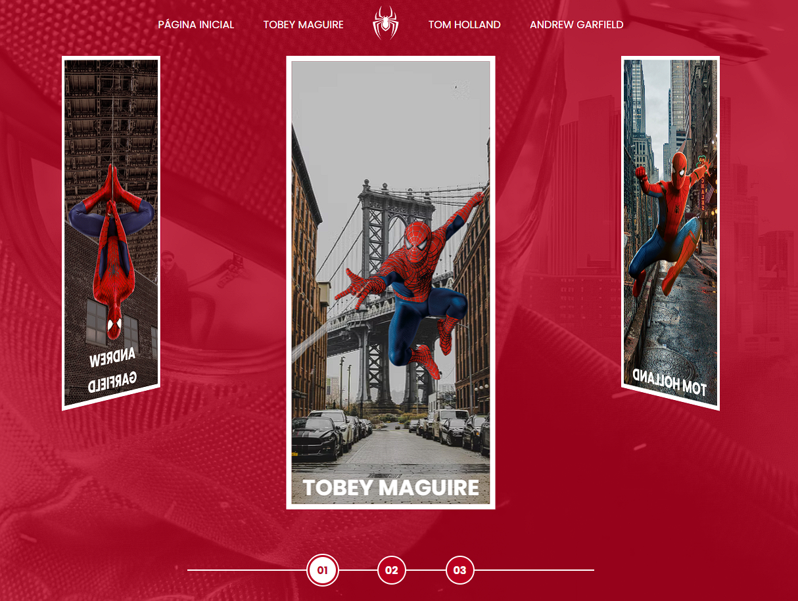

# Spider-Man Multiversos - DIO

Neste projeto foi usado os principais efeitos de CSS, animação, flexbox, pseudo-classes e pseudo-elemento. também foi explicado sobre componetes no CSS.

## Tecnologias usadas

- HTML
- CSS
- Javascript
- Fancybox (JQuery)
